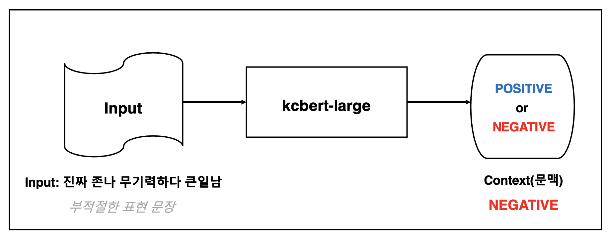
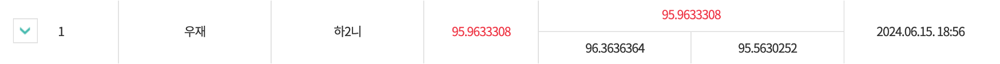
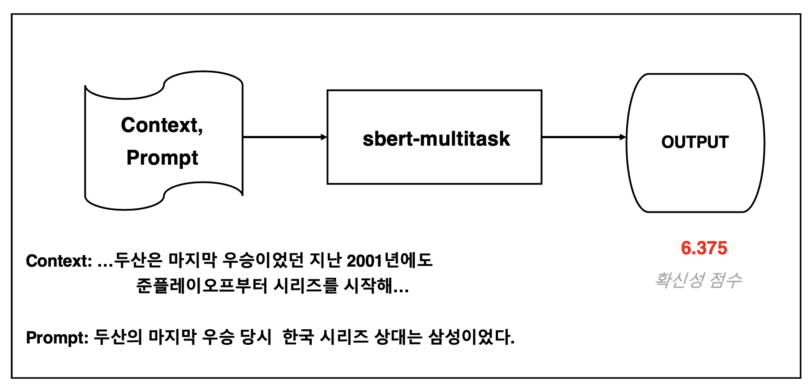
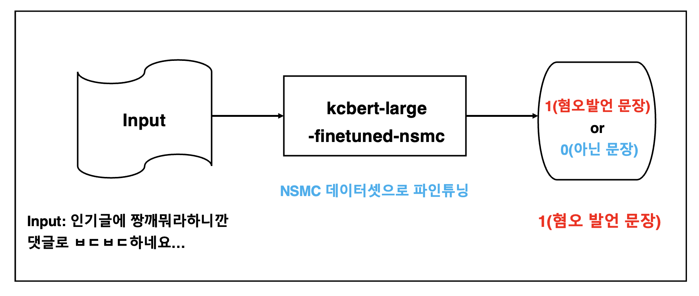
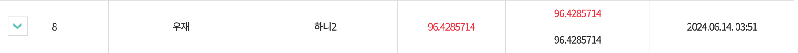

# Natuarl Language Processing and Practice Term project

2024년 1학기 자연어처리및실습(CSE541) 텀 프로젝트

<a href="https://kli.korean.go.kr/benchmark/home.do" target="_blank">국립국어원 인공지능(AI) 말평</a> 과제 수행을 기록한 저장소입니다.

## 부적절성 문장에 대한 태도 탐지 <a href="https://kli.korean.go.kr/benchmark/taskOrdtm/taskList.do?taskOrdtmId=108&clCd=ING_TASK&subMenuId=sub01" target="_blank">🔗</a>

부적절성 문장에 대한 태도 탐지 과제는 부적절하게 표현된 문장 표현의 문맥상 긍정적 또는 부정적 태도를 판단하는 작업이다. 자연어 처리에서는 상식 추론(Commonsense reasoning), 자연어 추론(NLI), 위노그래드 스키마 챌린지(Winograd schema challenge) 등에서 텍스트의 숨겨진 의미를 파악하는 능력을 검증한 사례가 있었으나, 부적절 표현을 대상으로 한 과제는 이전에 존재하지 않았다. 따라서 이 과제는 학술적으로도 의미가 크며, 기계의 추론 능력 확장에 기여하는 바 역시 클 것으로 예상한다. 부적절 표현 맥락에서의 태도 판단은 향후 온라인 플랫폼의 콘텐츠를 감시하거나 댓글 필터링 등 다양한 분야에서 응용될 수 있다는 점에서 의의가 있다.

[학습 및 평가 코드](https://github.com/jaewoogwak/nlp-term-project/blob/master/attitude-detection-for-inappropriate/run.ipynb)

### Model

**KcBERT-large**



#### Hyperparameter

```
epoch=10
learning_rate=5e-5
weight_decay=0.01
metric_for_best_model="f1_macro",
greater_is_better=True
```

#### Leaderboard



## 확신성 추론 <a href="https://kli.korean.go.kr/benchmark/taskOrdtm/taskList.do?taskOrdtmId=59&clCd=ING_TASK&subMenuId=sub01" target="_blank">🔗</a>

자연어 추론(Natural Language Inference)은 대표적인 언어 능력 평가 벤치마크인 GLUE, KLUE 등에서 제공하는 태스크로서, 주로 두 문장의 관계를 함의/중립/모순 중 하나로 분류한다. 국립국어원에서는 슈퍼글루(SuperGLUE)의 커미트먼트뱅크(CommitmentBank)를 참조하여, 2020년과 2021년 '말뭉치 함의 분석 및 연구' 사업을 통해 확신성 추론 말뭉치를 구축하였다. 이 말뭉치는 일반적인 자연어 추론 말뭉치와는 달리, 화자의 인식에 비추어 맥락과 제시 문장 간 함의 관계를 정도성으로 판단한다. 데이터 세트는 제시 문장(prompt)에 대하여 주어진 맥락(context)을 고려하였을 때 화자가 확신하는 정도를 1~7사이의 실수로 표현하는 방식으로 구성되어 있다. 숫자가 낮을수록(1에 가까울수록) 제시된 문장에 대해 화자가 확신하는 정도가 낮고, 숫자가 높을수록(7에 가까울수록) 화자가 확신하는 정도가 높다고 해석한다.

| 항목        | 내용                                                                                                                                                                                                                                                                                                                                         |
| ----------- | -------------------------------------------------------------------------------------------------------------------------------------------------------------------------------------------------------------------------------------------------------------------------------------------------------------------------------------------- |
| Context     | 17세기 영국 혁명에 대한 논쟁에서 순수 경제 결정론자들에 반대하여 청교도 정신(Puritanism)의 중요성에 대해 변함없이 주장했던 크리스토퍼 힐(Christopher Hill)이 마르크스주의자라는 사실을 깨닫는 사람은 많지 않다. 힐은 청교도 정신을 사람들이 믿었던 중요한 것으로 보았지, 계급 구조나 경제 운동 위에 있는 시시한 것에 불과하다고 보지 않았다. |
| Prompt      | 청교도 정신은 계급 구조나 경제 운동 위에 있는 시시한 것에 불과하다                                                                                                                                                                                                                                                                           |
| 확신성 점수 | 1.625                                                                                                                                                                                                                                                                                                                                        |

[학습 및 평가 코드](https://github.com/jaewoogwak/nlp-term-project/blob/master/certainty-inference/run.ipynb)

### Model

**ko-sbert-multitask**



#### Hyperparameter

```
epoch=10
learning_rate=5e-5
weight_decay=0.01,
greater_is_better=False,
metric_for_best_model="mse",
```

#### Leaderboard


## 혐오 발언 탐지 <a href="https://kli.korean.go.kr/benchmark/taskOrdtm/taskList.do?taskOrdtmId=56&clCd=ING_TASK&subMenuId=sub01" target="_blank">🔗</a>

자연어처리 분야에서 혐오 발언 탐지(Hate Speech Detection) 과제는 주어진 문장이 혐오(hate) 표현이나 공격적(offensive) 표현에 해당하는지 아닌지를 분류하는 과제이다. 최근 소셜미디어 등의 콘텐츠가 급속히 증가함에 따라 혐오 표현 탐지에 관한 연구가 활발하게 이루어지고 있으며, 기술개발 및 상용화의 수요도 증가하고 있다. 영어의 Kaggle의 Hate Speech and Offensive Language Dataset, HateXplain 데이터 세트가 대표적이며, 텍스트(문장 혹은 문서)가 혐오 표현인지, 공격적 표현인지, 혹은 혐오나 공격적 표현이 아닌 문장인지를 구분하는 과업으로 정의되어 있다.

[학습 및 평가 코드](https://github.com/jaewoogwak/nlp-term-project/blob/master/hate-speech-detection/run.ipynb)

### Model

**kcbert-large-finetuned-nsmc**



#### Hyperparameter

```
epoch=10
learning_rate=5e-5
weight_decay=0.01,
greater_is_better=True,
metric_for_best_model="f1",
```

#### Leaderboard


